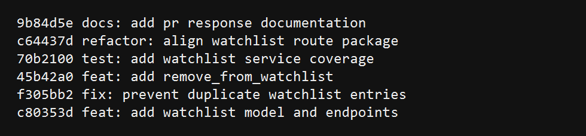

# PR Response Doc - CineLog Watchlist Feature

## AI Usage

I used Codex to orient around the existing CineLog patterns before making changes. Specifically, I asked it to inspect `models.py`, `services/collection_service.py`, and `tests/test_collection.py`, then used the actual code to verify the naming, deduplication, and test fixture patterns before implementing the watchlist changes. I also used Codex as a final hygiene check for the branch history: the commits use conventional prefixes and each commit represents one logical change.

## Comment 1 - Rename

**What I did:** The upstream PR used `save_to_watchlist()`, but CineLog's service convention is `verb_to_noun`, matching `add_to_collection()` and `remove_from_collection()`. I renamed the service function to `add_to_watchlist()` and updated the route call site in `routes/watchlist/watchlist.py`. I also searched the repo for both `save_to_watchlist` and `add_to_watchlist` to confirm there were no stale call sites.

**How I verified:** I ran `rg "save_to_watchlist|add_to_watchlist|AlreadyInWatchlist" -n` and confirmed only `add_to_watchlist()` remains. I also ran `pytest tests/ -v`.

## Comment 2 - Deduplication

**What I did:** I added service-level deduplication to `add_to_watchlist()` using the same pattern as `add_to_collection()`: query for an existing `(user_id, film_id)` entry before inserting, then raise a named conflict exception if one already exists. I added `AlreadyInWatchlistError` and mapped it to HTTP 409 in the watchlist route. The model also has a database uniqueness constraint so the application-level check and database invariant agree.

**How I verified:** `tests/test_watchlist.py::test_add_to_watchlist_duplicate_raises` adds the same film twice and asserts that `AlreadyInWatchlistError` is raised and only one row exists. The full suite passes with `pytest tests/ -v`.

## Comment 3 - Missing Test

**What I did:** I created `tests/test_watchlist.py` and added the requested equivalent of `test_add_to_collection_nonexistent_film_raises`. The watchlist test uses the same in-memory app fixture style and a fake UUID: `00000000-0000-0000-0000-000000000000`.

**How I verified:** I ran `pytest tests/test_watchlist.py -v` and then `pytest tests/ -v`; both passed.

## Comment 4 - Default Visibility

**My position:** Keep `public=True` as the default, but allow callers to explicitly pass `public=False`.

**Reasoning:** CineLog is a community film tracking app, so the watchlist is part of the user's social profile unless the caller chooses otherwise. Matching that default keeps the common path simple: a user adds a movie they are interested in, and friends can discover it without extra configuration. I added an explicit `public` parameter to `add_to_watchlist()` and the POST body so clients are not trapped by the default.

**Tradeoff acknowledged:** The privacy-first alternative is defensible: default-private avoids accidentally sharing intent to watch something. I think that tradeoff is better handled with an explicit `public=False` option here because the existing product framing emphasizes community discovery, not private note-taking. If CineLog later adds account-level privacy defaults, this service parameter can honor that setting without changing the endpoint shape.

## Comment 5 - Sort Order

**My position:** Use date-added descending for `get_watchlist()`.

**Reasoning:** I changed/kept the final watchlist behavior to mirror `get_collection()`: newest additions first. A watchlist is usually an intent queue, and the newest entries often represent the user's current interest. That makes the default response useful without requiring clients to re-sort.

**Engagement with reviewer's point:** Alphabetical sorting is easier to scan when a user has a large list and remembers the title, so I understand the maintainer's concern. I still prefer newest-first as the service default because it preserves user action context and matches the collection service. A future query parameter such as `?sort=title` would be a good extension if the UI needs browse-style scanning.

## Comment 6 - Rebase

**What conflicted:** The original `upstream/feature/watchlist` branch was based on the pre-refactor model where `Film.id` and watchlist `film_id` were integers. `main` has since migrated film IDs to UUID strings.

**How I resolved it:** The final `feature/watchlist` branch is based on the updated `origin/main` UUID model. `WatchlistEntry.film_id` is `db.String(36)`, route docs and tests use UUID strings, and the watchlist service accepts UUID `film_id` values just like the collection service.

**How I verified no conflict remains:** I ran `git fetch origin`, `git rebase origin/main`, and Git reported the branch was up to date. I also ran `git log --oneline --merges origin/main..HEAD`, which produced no merge commits, and `pytest tests/ -v`, which passed.

## Stretch Features

**remove_from_watchlist():** I added `remove_from_watchlist(user_id, film_id)` with a `NotInWatchlistError`, plus a DELETE `/watchlist/<user_id>/remove` endpoint. The tests verify successful deletion and the missing-entry error case.

**Second test:** I added `test_get_watchlist_returns_newest_first` because sort order was a design decision and should be protected by a test. I also added visibility coverage for `public=False` because the endpoint now lets callers choose visibility explicitly.

**Visibility toggle:** `add_to_watchlist()` accepts `public=True` by default, and the route reads an optional `"public"` request body field. That lets clients create private entries without adding a separate update call.

## Git Log Screenshot



Current branch history:

```text
9b84d5e docs: add pr response documentation
c64437d refactor: align watchlist route package
70b2100 test: add watchlist service coverage
45b42a0 feat: add remove_from_watchlist
f305bb2 fix: prevent duplicate watchlist entries
c80353d feat: add watchlist model and endpoints
```

## PR Description

This PR adds a watchlist feature to CineLog so users can save films they plan to watch later. It adds a `WatchlistEntry` model, service functions for adding, listing, and removing watchlist entries, and REST endpoints under `/watchlist`.

Design decisions:

- Visibility defaults to public because CineLog is community-oriented, but callers can pass `public: false` when they need a private entry.
- Watchlists are returned newest-first to match `get_collection()` and preserve recent user intent.

Manual testing:

1. Start the app with `python app.py`.
2. Use an existing or test-created user UUID and film UUID.
3. Add a film with `POST /watchlist/<user_id>/add` and body `{ "film_id": "<film_uuid>" }`.
4. Add a private entry with body `{ "film_id": "<film_uuid>", "public": false }`.
5. Fetch the list with `GET /watchlist/<user_id>` and confirm newest entries appear first.
6. Try adding the same film again and confirm the endpoint returns 409.
7. Remove a film with `DELETE /watchlist/<user_id>/remove` and body `{ "film_id": "<film_uuid>" }`.
8. Run `pytest tests/ -v` to verify the service behavior.
